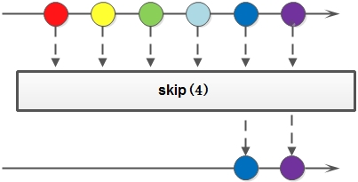

# Streaming API Using
## Iterate collection items before Java 8
Example: Word count

*Java 7 style*
```java
String[] kpiNames = trackable.getKpis();
for (String kpiName : kpiNames) {
    double kpiValue = trackable.getAndResetKpiValue(kpiName);
    buffer.append(kpiName).append(" = ").append(kpiValue).append(", ");
}
logger.info(buffer.toString());
```

*Java 8 style*
```java
Stream.of(trackable.getKpis()).
    forEach(kpiName -> {
        double kpiValue = trackable.getAndResetKpiValue(kpiName);
        buffer.append(kpiName).append(" = ").append(kpiValue).append(", ");
    });
logger.info(buffer.toString());
```

## Benefits from Streaming API
* d

## Create a Stream
### Using Stream.of
```java
Stream<String> stream = Stream.of("a", "b", "c");
```
### Implement Supplier
```java
Stream.generate(new Supplier<String>() {
    @Override
    public String get() {
        return String.valueOf(Math.random());
    }
})
```
```java
Stream.generate(() -> String.valueOf(Math.random()));
```
```java
Stream.generate(String.valueOf(Math.random())); /// may be wrong
```
### Get Stream from Collection

# Convert Stream
转换Stream其实就是把一个Stream通过某些行为转换成一个新的Stream。

1. distinct: 对于Stream中包含的元素进行去重操作（去重逻辑依赖元素的equals方法），新生成的Stream中没有重复的元素


1. filter: 对于Stream中包含的元素使用给定的过滤函数进行过滤操作，新生成的Stream只包含符合条件的元素


1. map: 对于Stream中包含的元素使用给定的转换函数进行转换操作，新生成的Stream只包含转换生成的元素


1. flatMap：和map类似，不同的是其每个元素转换得到的是Stream对象，会把子Stream中的元素压缩到父集合中


1. peek: 生成一个包含原Stream的所有元素的新Stream，同时会提供一个消费函数（Consumer实例），新Stream每个元素被消费的时候都会执行给定的消费函数


1. limit: 对一个Stream进行截断操作，获取其前N个元素，如果原Stream中包含的元素个数小于N，那就获取其所有的元素


1. skip: 返回一个丢弃原Stream的前N个元素后剩下元素组成的新Stream，如果原Stream中包含的元素个数小于N，那么返回空Stream


# Reduce Stream
A reduction operation (also called a fold) takes a sequence of input elements and combines them into a single summary result by repeated application of a combining operation, such as finding the sum or maximum of a set of numbers, or accumulating elements into a list. The streams classes have multiple forms of general reduction operations, called reduce() and collect(), as well as multiple specialized reduction forms such as sum(), max(), or count().

## 可变汇聚

Reference: http://ifeve.com/stream/
