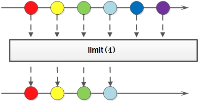

# Streaming API Introduction

Stream interface definition: A sequence of elements supporting sequential and parallel aggregate operations.

## Using Stream API

Example: Count non-null string from a string array.

*Old Style*
```java
String[] strs = new String[] { "a", null, "b", "c", null, "d" };
int numNonNull = 0;
for (String str : strs) {
    if (str != null) {
        numNonNull += 1;
    }
}
System.out.println("The number of non-null string is: " + numNonNull);

```
*Using Java 8 Streaming API*
```java
String[] strs = new String[] { "a", null, "b", "c", null, "d" };
long numNonNull = Stream.of(strs).filter(str -> str != null).count();
System.out.println("The number of non-null string is: " + numNonNull);
```
## Parse Stream
* Create Stream
* Convert Stream
* Reduce Stream

## Benefits from Streaming API
* Easy to use
* High performance
* Tell what to do not how to do

## Create Stream
### Using Stream Interface
```java
Stream<String> stream = Stream.of("a", "b", "c");
```
### Implement Supplier Interface
```java
public class RandomStream {

    public static void main(String[] args) {
        Stream<String> stream = Stream.generate(new Supplier<String>() {
            @Override
            public String get() {
                return String.valueOf(Math.random());
            }
        });
        stream.limit(10).forEach(System.out::println);
    }
}
```
Less code version
```java
Stream<String> stream = Stream.generate(() -> String.valueOf(Math.random()));
stream.limit(10).forEach(System.out::println);
```
Using generate method will generate a unlimited Stream, if we need use the Stream we need limit its length.

### Get Stream from Collection
```java
long numNonNull = strings.stream().filter(str -> str != null).count();
System.out.println("The number of non-null string is: " + numNonNull);
```

## Intermediate Operation
转换Stream其实就是把一个Stream通过某些行为转换成一个新的Stream。

1. distinct: Returns a stream consisting of the distinct elements (according to Object.equals(Object)) of this stream.


1. filter: Returns a stream consisting of the elements of this stream that match the given predicate.


1. map: Returns a stream consisting of the results of applying the given function to the elements of this stream.


1. flatMap：
Returns a stream consisting of the results of replacing each element of this stream with the contents of a mapped stream produced by applying the provided mapping function to each element. Each mapped stream is closed after its contents have been placed into this stream. (If a mapped stream is null an empty stream is used, instead.)
FlatMap transforms each element of the stream into a stream of other objects. So each object will be transformed into zero, one or multiple other objects backed by streams. The contents of those streams will then be placed into the returned stream of the flatMap operation.

Example Code
```java
public class FlatMapStream {
    public static void main(String[] args) throws Exception {
        Stream<String> lines = Files.lines(
                new File("test.txt").toPath(), StandardCharsets.UTF_8);
        lines.flatMap(line -> Stream.of(line.split("=")))
                .forEach(System.out::println);
        lines.close();
    }
}
```

1. peek
Returns a stream consisting of the elements of this stream, additionally performing the provided action on each element as elements are consumed from the resulting stream.

Example: Intermediate operation vs. Terminal operation
Using peek Only: 
```java
List<String> list = Arrays.asList("Bender", "Fry", "Leela");
list.stream().peek(System.out::println);
```
vs. Plus foreach:
```java
List<String> list = Arrays.asList("Bender", "Fry", "Leela");
list.stream()
    .peek(System.out::println)
    .forEach(System.out::println);
```

1. limit: 
Returns a stream consisting of the elements of this stream, truncated to be no longer than maxSize in length.


1. skip:
Returns a stream consisting of the remaining elements of this stream after discarding the first n elements of the stream. If this stream contains fewer than n elements then an empty stream will be returned.


## Terminal operation
A reduction operation (also called a fold) takes a sequence of input elements and combines them into a single summary result by repeated application of a combining operation, such as finding the sum or maximum of a set of numbers, or accumulating elements into a list. The streams classes have multiple forms of general reduction operations, called reduce() and collect(), as well as multiple specialized reduction forms such as sum(), max(), or count().

### Mutable Reducation

A mutable reduction operation accumulates input elements into a mutable result container, such as a Collection or StringBuilder, as it processes the elements in the stream.

Example: String concat
```java
Stream<String> strings = Stream.of("a", "b", "c", "d");
System.out.println(strings.reduce("", String::concat));
```
We would get the desired result, and it would even work in parallel. However, we might not be happy about the performance! Such an implementation would do a great deal of string copying, and the run time would be O(n^2) in the number of characters. A more performant approach would be to accumulate the results into a StringBuilder, which is a mutable container for accumulating strings. We can use the same technique to parallelize mutable reduction as we do with ordinary reduction.

1. collect
Interface Definition
```java
<R> R collect(Supplier<R> supplier,
              BiConsumer<R,? super T> accumulator,
              BiConsumer<R,R> combiner)
```
Performs a mutable reduction operation on the elements of this stream. A mutable reduction is one in which the reduced value is a mutable result container, such as an ArrayList, and elements are incorporated by updating the state of the result rather than by replacing the result.
Note: The combiner is only used in parallel Streams (to combine the partial outputs of the parallel computations)
```java
List<Integer> strs = Arrays.asList(1, null, 3, 5, null, 8);
List<Integer> rtn = strs.parallelStream()
    .filter(num -> num != null)
    .collect(
        () -> new ArrayList<Integer>(),
        (list, item) -> list.add(item),
        (list1, list2) -> list1.addAll(list2));
System.out.println(rtn);
```
Using Method Reference:
```java
List<Integer> rtn2 = strs.parallelStream()
    .filter(num -> num != null)
    .collect(
        ArrayList::new, 
        ArrayList::add, 
        ArrayList::addAll);
System.out.println(rtn2);
```
Using Collector:
```java
List<Integer> rtn3 = strs.parallelStream()
    .filter(num -> num != null)
    .collect(Collectors.toList());
System.out.println(rtn3);
```

### Other Reducation

1. reduce

1. count

1. allMatch

1. anyMatch

1. findFirst

1. noneMatch

1. max and min

## Parallel Streams

Streams can be executed in parallel to increase runtime performance on large amount of input elements. Parallel streams use a common ForkJoinPool available via the static ForkJoinPool.commonPool() method. The size of the underlying thread-pool uses up to five threads - depending on the amount of available physical CPU cores:
```java
ForkJoinPool commonPool = ForkJoinPool.commonPool();
System.out.println(commonPool.getParallelism());
```
This value can be decreased or increased by setting the following JVM parameter:
```java
-Djava.util.concurrent.ForkJoinPool.common.parallelism=5
```


Reference: http://ifeve.com/stream/
http://winterbe.com/posts/2014/07/31/java8-stream-tutorial-examples/


*Java 7 style*
```java
String[] kpiNames = trackable.getKpis();
for (String kpiName : kpiNames) {
    double kpiValue = trackable.getAndResetKpiValue(kpiName);
    buffer.append(kpiName).append(" = ").append(kpiValue).append(", ");
}
logger.info(buffer.toString());
```

*Java 8 style*
```java
Stream.of(trackable.getKpis()).
    forEach(kpiName -> {
        double kpiValue = trackable.getAndResetKpiValue(kpiName);
        buffer.append(kpiName).append(" = ").append(kpiValue).append(", ");
    });
logger.info(buffer.toString());
```
